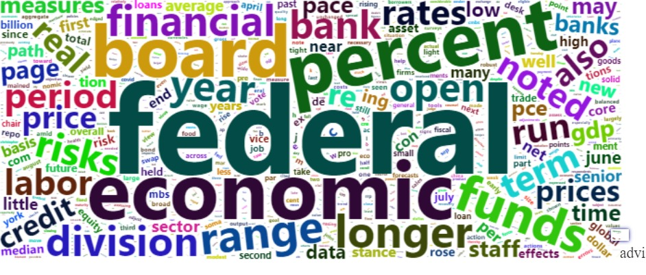
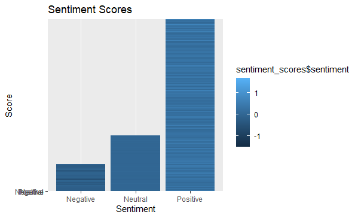
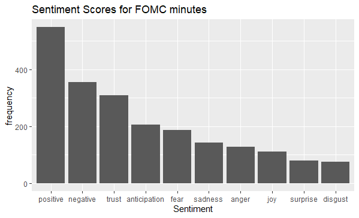
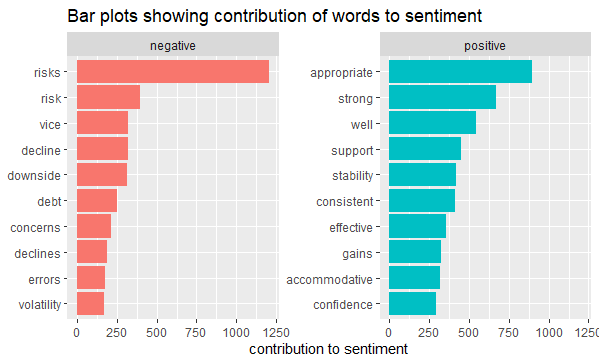

# 📊 Sentiment Analysis of FOMC Minutes using R
## ✍️ Author

**Esdras Koome Micheni**  

This project performs a detailed sentiment analysis of the **FOMC (Federal Open Market Committee)** minutes using multiple R packages. The project extracts sentiment scores, visualizes emotional tones, and identifies key contributing words using various lexicons.

## 📁 Project Structure

```
FOMC-Sentiment-Analysis/
│
├── data/
│ └── Merged PDF File for all FOMC minutes.pdf
│
├── output/
│ ├── Tokenized dataframe.csv
│ └── Tokenized dataframe2.csv
│
├── plots/
│ ├── sentiment_score_barplot.png
│ ├── nrc_emotions_barplot.png
│ └── bing_top10_words.png
│
├── FOMC_Sentiment_Analysis.R # Main R script
├── README.md
└── LICENSE
```

## 🛠 Packages Used

- `readtext` – Read PDF and text files easily
- `sentimentr` – Sentence-level sentiment analysis
- `SentimentAnalysis` – High-level sentiment tools
- `syuzhet` – NRC and other sentiment lexicons
- `tidytext` – Tokenization and sentiment joining
- `dplyr`, `ggplot2`, `stringr` – Data manipulation and visualization
- `pdftools` – Alternative PDF reading (optional)
- `stopwords` – Optional: to remove stop words before analysis

## 📄 Description of Steps

### 1. 📥 Data Import
- Load the FOMC minutes from a merged PDF file.

### 2. 📈 Sentiment Analysis (Method 1: sentimentr)
- Calculates sentiment scores for each sentence in the text.
- Categorizes each sentence as **Positive**, **Negative**, or **Neutral** based on thresholds.

### 3. 📊 NRC Emotion Analysis (Method 2: syuzhet)
- Analyzes emotional tone using the NRC lexicon.
- Displays frequency of emotions such as *joy*, *trust*, *anger*, *fear*, etc.

### 4. 🧾 Word Contribution (Method 3: tidytext + Bing lexicon)
- Tokenizes the entire text.
- Joins with the Bing lexicon to assign sentiment.
- Visualizes the **top 10 contributing words** for both positive and negative sentiments.

### 5. 🧹 Tokenization & Export
- Tokenizes the full PDF text into individual words.
- Saves clean tokens and sentiment summaries as `.csv` files.

## 📊 Sample Visualizations
### Word Cloud Sentiments

### Sentiment Classification  


### NRC Emotions Distribution  


### Word Contribution by Sentiment  


> 💡 Note: You must generate and save these plots using `ggsave()` or the Export button in RStudio.

---

## 💾 Exported Files

| File                            | Description                                  |
|---------------------------------|----------------------------------------------|
| Tokenized dataframe.csv         | All individual words from the PDF            |
| Tokenized dataframe2.csv        | Summarized NRC emotion scores                |

---

## 🧠 Potential Improvements

- Use `wordcloud` or `wordcloud2` package to create a word cloud.
- Apply `topicmodels` (LDA) for topic modeling.
- Incorporate time-series trends (if multiple years of data are used).

---

## 📜 License

This project is open-source under the [MIT License](LICENSE).

---


## 📬 Connect With Me

- 📧 Email: [esdraskoome@gmail.com](mailto:esdraskoome@gmail.com)  
- 💼 [LinkedIn](https://www.linkedin.com/in/esdras-koome-micheni-106651338/)  
- 🧑‍💻 [Upwork Profile](https://www.upwork.com/freelancers/~01bbdaff1dc6ce0241)  
- ▶ [YouTube Channel](https://www.youtube.com/channel/UCBhBTBAanuBNiQs3r7mwDmA)


